# Dungeon 2D

- Thử nghiệm game:
    * drive: https://drive.google.com/file/d/1vcCBIHNx8RkXRN8LEdq1af8w9Wbzo8_K/view?usp=drive_link
    * youtube: https://youtu.be/MvOKzJYwZco?si=78YS1wGxX8nzJ4YU
- Phá đảo game: 

# Giới thiệu game
-Trong Dungeon 2D, người chơi sẽ nhập vai vào một nhân vật can đảm, sở hữu một thanh kiếm sắc bén, sẵn sàng đối đầu với các thử thách nguy hiểm.\
-Mỗi màn chơi trong game đều sẽ có quái vật không ngừng tìm kiếm và tiến gần để giết bạn. Nhiệm vụ của bạn là chiến đấu với quái vật và tiêu diệt chúng để mở khóa màn chơi tiếp theo.\
-Ngoài ra, nếu bạn muốn thử thách bản thân, Dungeon 2D còn cung cấp một chế độ tự do. Trong chế độ này, bạn có thể điều chỉnh mức độ khó dễ của trò chơi, tạo ra những trải nghiệm độc đáo phù hợp với khả năng và sở thích của bạn.

- [0. Cách tải game](#0-cách-tải-game)
- [1. Bắt đầu game](#1-bắt-đầu-game)
- [2. Chọn level](#2-chọn-level)
- [3. Chế độ SPACE MOD](#3-Chế-độ-SPACE-MOD)    
- [4. Các thành phần trong game:](#4-các-thành-phần-trong-game)
- [5. Cách chơi](#5-cách-chơi)
    * [a. Nhân vật](#a-nhân-vật)
    * [b. Các loại quái trong game](#b-các-loại-quái-trong-game)
- [6. Chiến thắng và thất bại](#6-chiến-thắng-và-thất-bại)
- [Về đồ họa của game:](#về-đồ-họa-của-game)
- [Về source code game](#về-source-code-game)

# 0. Cách tải game.
## Dành cho hệ điều hành windown (không bao gồm code)
- Tải game (được nén thành .zip) tại link
sau: https:https://github.com/trinhxuanhoa/testgit/releases/tag/dungeon2d 
khoảng 57MB. 
-tải mục thứ nhất. 

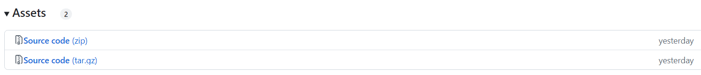

- Giải nén game vào một thư mục và bật dungeon2d.exe lên và chơi. 

# 1. Bắt đầu game
- Chờ một chút rồi click vào nút “START GAME” để bắt đầu chơi game.

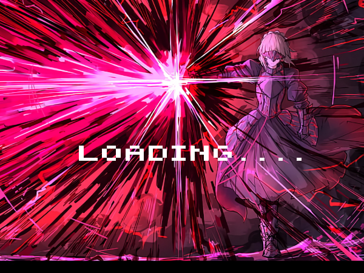

- Khi vào game, người chơi hãy hãy nhấn vào **Start Game** để bắt đầu.

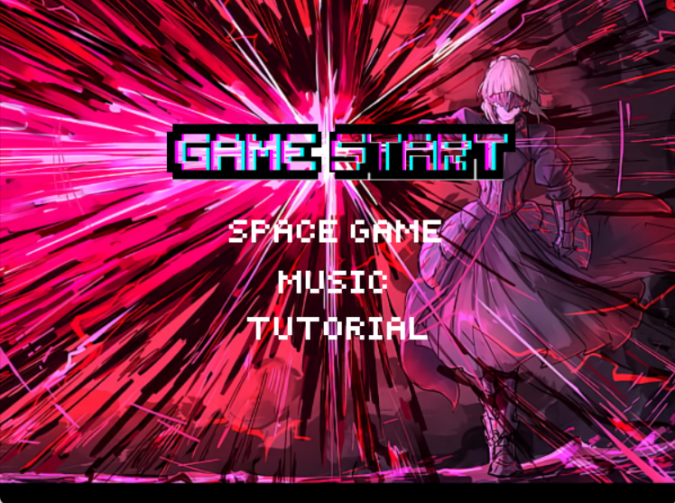

# 2. Chọn level

- có 5 level.  Chỉ cần click chuột để chơi level đó.

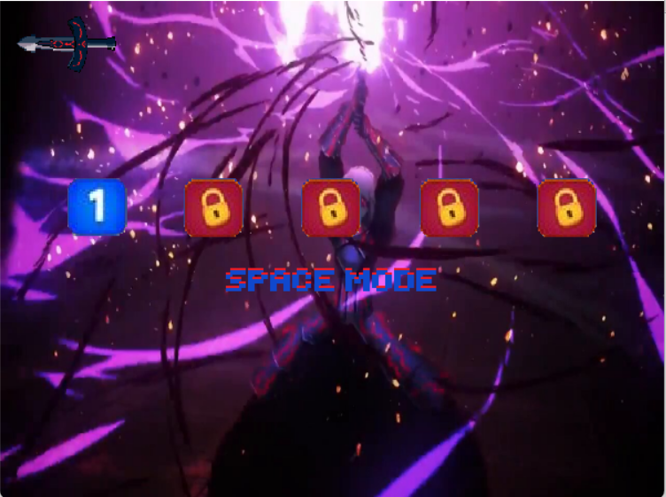

- Tuy nhiên khi mới bắt đầu, bạn chỉ mở được 1 level. Chiến thắng lần lượt từng level để mở khóa và chơi level tiếp theo.

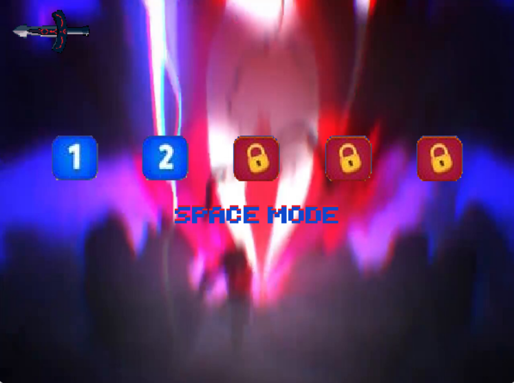

- Ngoài ra còn có 1 nút chức năng khác để người chơi quay lại "GAME START"

- Khi vào game, sẽ có 1 hoặc 2 con quái sẽ đuổi giết bạn. Nhiệm vụ của bạn là giết nó để qua màn.

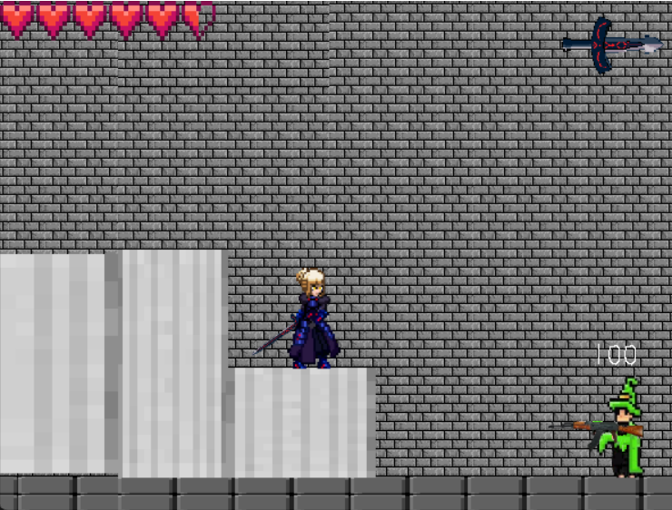

# 3. Chế độ SPACE MOD

- chế độ này là chế độ tự do để thử thách bản thân. Bạn có thể chỉnh mức độ khó, dễ của game trong phần **space game**

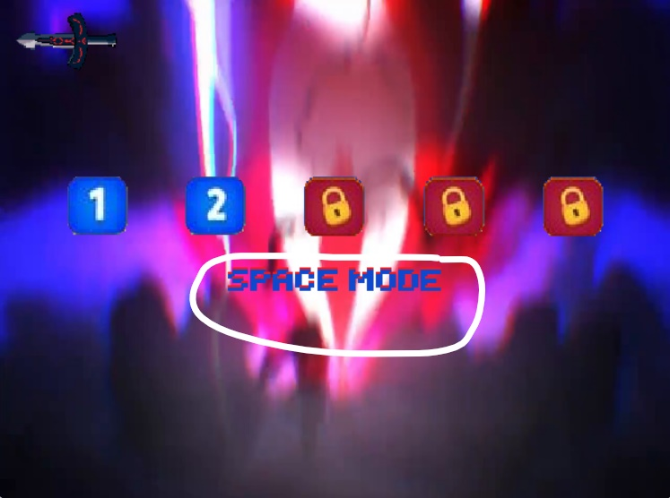

trên màn hình sẽ xuất hiện số quái bạn tiêu diệt

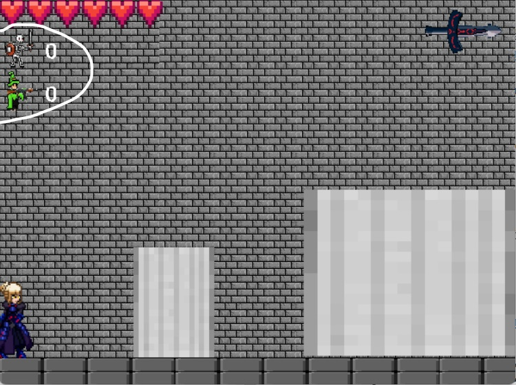

# 4. Các thành phần trong game:

## Trong dao diện **game start**

### Phần **space game** dành cho chế độ **space mode**

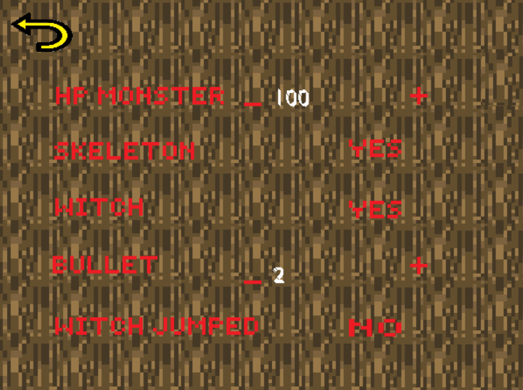

# Dungeon 2D

- Thử nghiệm game: 
- Phá đảo game: 

# Giới thiệu game
-Trong Dungeon 2D, người chơi sẽ nhập vai vào một nhân vật can đảm, sở hữu một thanh kiếm sắc bén, sẵn sàng đối đầu với các thử thách nguy hiểm.\
-Mỗi màn chơi trong game đều sẽ có quái vật không ngừng tìm kiếm và tiến gần để giết bạn. Nhiệm vụ của bạn là chiến đấu với quái vật và tiêu diệt chúng để mở khóa màn chơi tiếp theo.\
-Ngoài ra, nếu bạn muốn thử thách bản thân, Dungeon 2D còn cung cấp một chế độ tự do. Trong chế độ này, bạn có thể điều chỉnh mức độ khó dễ của trò chơi, tạo ra những trải nghiệm độc đáo phù hợp với khả năng và sở thích của bạn.

- [0. Cách tải game](#0-cách-tải-game)
- [1. Bắt đầu game](#1-bắt-đầu-game)
- [2. Chọn level](#2-chọn-level)
- [3. Chế độ SPACE MOD](#3-Chế-độ-SPACE-MOD)    
- [4. Các thành phần trong game:](#4-các-thành-phần-trong-game)
- [5. Cách chơi](#5-cách-chơi)
    * [a. Nhân vật](#a-nhân-vật)
    * [b. Các loại quái trong game](#b-các-loại-quái-trong-game)
- [6. Chiến thắng và thất bại](#6-chiến-thắng-và-thất-bại)
- [Về đồ họa của game:](#về-đồ-họa-của-game)
- [Về source code game](#về-source-code-game)

# 0. Cách tải game.
## Dành cho hệ điều hành windown (không bao gồm code)
- Tải game (được nén thành .zip) tại link
sau: https:https://github.com/trinhxuanhoa/testgit/releases/tag/dungeon2d 
khoảng 57MB. 
-tải mục thứ nhất. 

- Giải nén game vào một thư mục và bật dungeon2d.exe lên và chơi. 

# 1. Bắt đầu game
- Chờ một chút rồi click vào nút “START GAME” để bắt đầu chơi game.

- Khi vào game, người chơi hãy hãy nhấn vào **Start Game** để bắt đầu.

# 2. Chọn level

- có 5 level.  Chỉ cần click chuột để chơi level đó.

- Tuy nhiên khi mới bắt đầu, bạn chỉ mở được 1 level. Chiến thắng lần lượt từng level để mở khóa và chơi level tiếp theo.

- Ngoài ra còn có 1 nút chức năng khác để người chơi quay lại "GAME START"

- Khi vào game, sẽ có 1 hoặc 2 con quái sẽ đuổi giết bạn. Nhiệm vụ của bạn là giết nó để qua màn.

# 3. Chế độ SPACE MOD

- chế độ này là chế độ tự do để thử thách bản thân. Bạn có thể chỉnh mức độ khó, dễ của game trong phần **space game**

trên màn hình sẽ xuất hiện số quái bạn tiêu diệt

# 4. Các thành phần trong game:

## Trong dao diện **game start**

### Phần **space game** dành cho chế độ **space mode**

-  : tăng chỉ số của một thành phần trong game.

-  : giảm chỉ số của một thành phần trong game.

-  : bật quái.

-  : tắt quái.

- **HB MONSTER**   : để chỉnh lượng máu của quái
 
- **SKELETON**     : có thể chỉnh cho quái skeleton xuất hiện hoặc không

- **WITCH**        : có thể chỉnh cho quái witch xuất hiện hoặc không

- *lưu ý: không thẻ chỉnh cho cả hai con quái đều không xuất hiện*

- **BULLET**       : có thể tăng hoặc giảm lượng đạn mà quái witch bắn ra

- **WITCH JUMPED** : witch có thể nhảy lên để bắn bạn nếu bạn đứng cao hơn nó

### Phần **muisic**

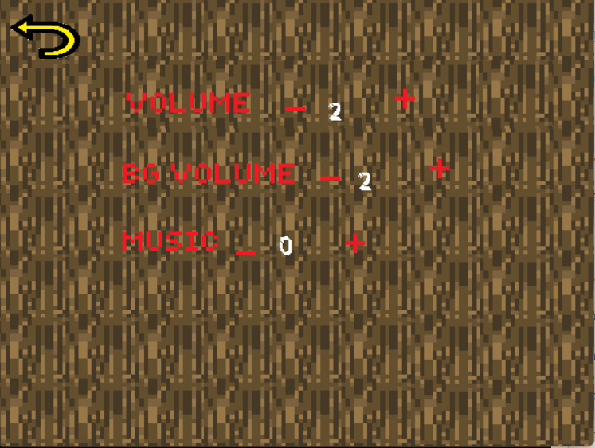

- **VOLUME**    : chỉnh âm lượng khi bạn tấn công và âm lượng của quái

- **BG VOLUME** : chỉnh âm thanh nền

- **MUISIC**    : thay đổi âm thanh nền

### Phần **tutorial** bao gồm các hướng dẫn cơ bản để chơi

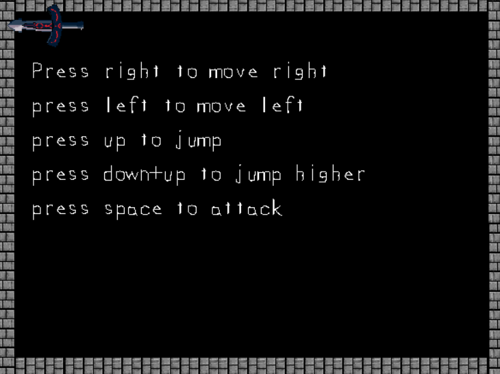

- 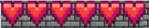 : Tính số là số lượng tim bạn đang có.

- 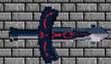 : Tạm dừng game

- Nếu bạn muốn tiếp tục nhấn **continue** 

- Nếu bạn muốn thoát nhấn **exit**

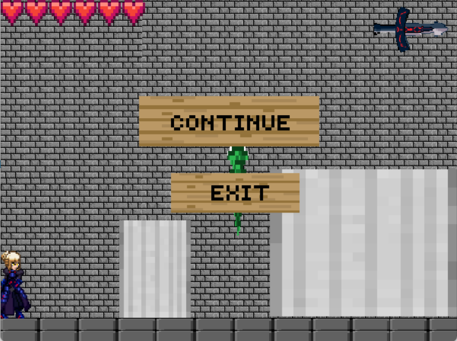

-  : quay trở lại giao diện **game start**

- Giao diện game

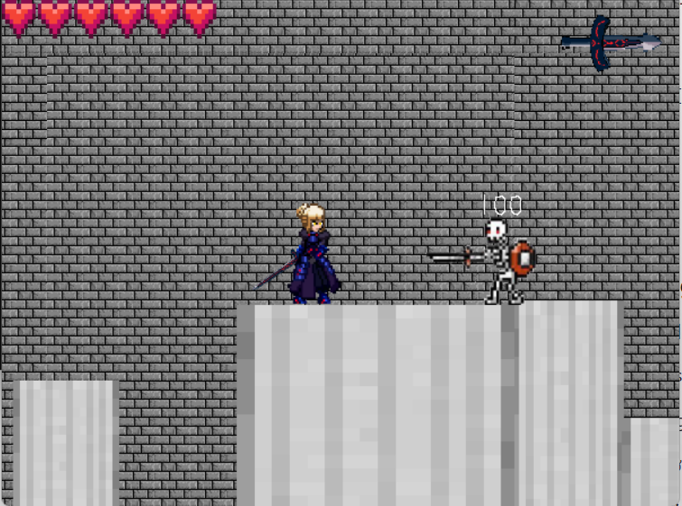

# 5. Cách chơi 

-Người chơi di chuyển qua lại trách bị quái đánh trúng, đồng thời nhấn space để tấn công quái.

## a. Nhân vật

 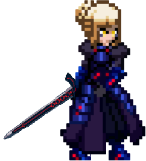: Tên nhân vật là Saber, lượng máu là 120, mỗi lần tấn công sẽ chém ra một luồng khí đến kẻ địch khiến nó mất máu.
 
 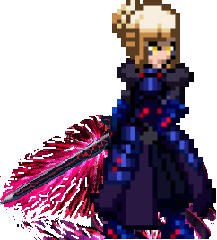: Saber vận khí giúp nhảy cao hơn.

## b. Các loại quái trong game

- Có 2 loại quái trong game

|                                                                             | Tên quái	     | Chức năng                                                                                                                    |
|-----------------------------------------------------------------------------|--------------|------------------------------------------------------------------------------------------------------------------------------|
| 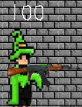  | Witch	  | Mỗi lần có thể bắn từ 1 đến 10 vên đạn, lượng máu mặc định là 100.                                                                                              |
| 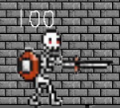  | Skeleton	  | Tiến lại gần để chém bạn, lượng máu mặc định là 100.                                                                                              |

# 6. Chiến thắng và thất bại

- Bạn sẽ chiến thắng nếu tiêu diệt hết tất cả quái trong màn đó. màn hình sẽ xuất hiện một giao diện
        * Nếu muốn chơi màn tiếp theo nhấn **continue**
         
        * Nếu muốn thoát nhấn **exit**

- Bạn sẽ thất bại nếu bạn mất hết máu

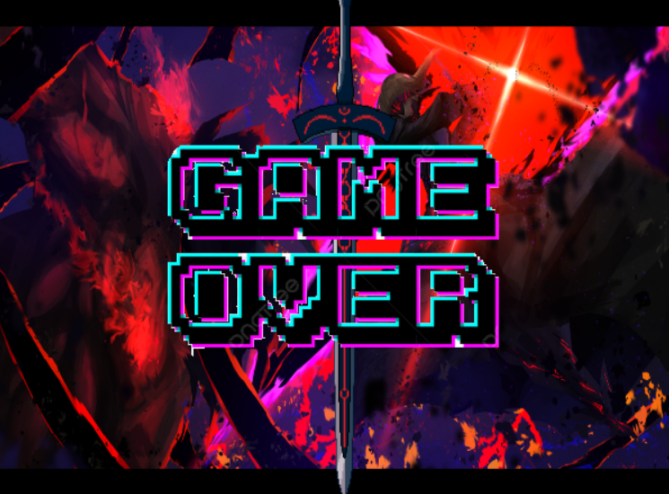

### Về đồ họa của game:

- [[dùng xilart để xóa phong, tạo hiệu ứng]](https://www.pixilart.com/draw#)

### Về source code game:

- main.cpp
    * xử lý các dữ liệu đầu vào đầu ra của các file .cpp khác và màn chơi.
- stlutils.cpp và surface.cpp:
    * khởi tạo window và renderer.
    * chứa hầu hết các câu lệnh của SDL2, SDL2_image, SDL2_ttf, sử dụng để vẽ load ảnh, chữ và vẽ lên renderer, window.
- motion.cpp: 
    * sử lý các sự kiện, va chạm, di chuyển của nhân vật trong game.
- Ai.cpp:
    * sử lý các sự kiện, va chạm, di chuyển của quái trong game.
- music.cpp: 
    * xử lý phần âm thanh của game - SDL2_mixer.
-start.cpp: 
    * xử lý giao diện game start, space game.
- video.cpp:
   * xử lý video.

- **HB MONSTER**   : để chỉnh lượng máu của quái
 
- **SKELETON**     : có thể chỉnh cho quái skeleton xuất hiện hoặc không

- **WITCH**        : có thể chỉnh cho quái witch xuất hiện hoặc không

- *lưu ý: không thẻ chỉnh cho cả hai con quái đều không xuất hiện*

- **BULLET**       : có thể tăng hoặc giảm lượng đạn mà quái witch bắn ra

- **WITCH JUMPED** : witch có thể nhảy lên để bắn bạn nếu bạn đứng cao hơn nó

### Phần **muisic**

- **VOLUME**    : chỉnh âm lượng khi bạn tấn công và âm lượng của quái

- **BG VOLUME** : chỉnh âm thanh nền

- **MUISIC**    : thay đổi âm thanh nền

### Phần **tutorial** bao gồm các hướng dẫn cơ bản để chơi

-  : Tính số là số lượng tim bạn đang có.

-  : Tạm dừng game

- Nếu bạn muốn tiếp tục nhấn **continue** 

- Nếu bạn muốn thoát nhấn **exit**

-  : quay trở lại giao diện **game start**

- Giao diện game

# 5. Cách chơi 

-Người chơi di chuyển qua lại trách bị quái đánh trúng, đồng thời nhấn space để tấn công quái.

## a. Nhân vật

 : Tên nhân vật là Saber, lượng máu là 120, mỗi lần tấn công sẽ chém ra một luồng khí đến kẻ địch khiến nó mất máu.
 
 : Saber vận khí giúp nhảy cao hơn.

## b. Các loại quái trong game

- Có 2 loại quái trong game

|                                                                             | Tên quái	     | Chức năng                                                                                                                    |
|-----------------------------------------------------------------------------|--------------|------------------------------------------------------------------------------------------------------------------------------|
|   | Witch	  | Mỗi lần có thể bắn từ 1 đến 10 vên đạn, lượng máu mặc định là 100.                                                                                              |
|   | Skeleton	  | Tiến lại gần để chém bạn, lượng máu mặc định là 100.                                                                                              |

# 6. Chiến thắng và thất bại

- Bạn sẽ chiến thắng nếu tiêu diệt hết tất cả quái trong màn đó. màn hình sẽ xuất hiện một giao diện

        * Nếu muốn chơi màn tiếp theo nhấn COMTINUE
         
        * Nếu muốn thoát nhấn EXIT

- Bạn sẽ thất bại nếu bạn mất hết máu

### Về đồ họa của game:

- [[dùng xilart để xóa phong, tạo hiệu ứng]](https://www.pixilart.com/draw#)

### Về source code game:

- main.cpp
    * xử lý các dữ liệu đầu vào đầu ra của các file .cpp khác và màn chơi.
- stlutils.cpp và surface.cpp:
    * khởi tạo window và renderer.
    * chứa hầu hết các câu lệnh của SDL2, SDL2_image, SDL2_ttf, sử dụng để vẽ load ảnh, chữ và vẽ lên renderer, window.
- motion.cpp: 
    * sử lý các sự kiện, va chạm, di chuyển của nhân vật trong game.
- Ai.cpp:
    * sử lý các sự kiện, va chạm, di chuyển của quái trong game.
- music.cpp: 
    * xử lý phần âm thanh của game - SDL2_mixer.
-start.cpp: 
    * xử lý giao diện game start, space game.
- video.cpp:
    * xử lý video.
- Nguồn tham khảo
    * [lazyfoo](https://lazyfoo.net/tutorials/SDL/)
    * [couse.uet](https://courses.uet.vnu.edu.vn/loginform/index.php)

