# Dungeon 2D

- Thử nghiệm game: 
- Phá đảo game: 

# Giới thiệu game
-Trong Dungeon 2D, người chơi sẽ nhập vai vào một nhân vật can đảm, sở hữu một thanh kiếm sắc bén, sẵn sàng đối đầu với các thử thách nguy hiểm.\
-Mỗi màn chơi trong game đều sẽ có quái vật không ngừng tìm kiếm và tiến gần để giết bạn. Nhiệm vụ của bạn là chiến đấu với quái vật và tiêu diệt chúng để mở khóa màn chơi tiếp theo.\
-Ngoài ra, nếu bạn muốn thử thách bản thân, Dungeon 2D còn cung cấp một chế độ tự do. Trong chế độ này, bạn có thể điều chỉnh mức độ khó dễ của trò chơi, tạo ra những trải nghiệm độc đáo phù hợp với khả năng và sở thích của bạn.

- [0. Cách tải game](#0-cách-tải-game)
- [1. Bắt đầu game](#1-bắt-đầu-game)
- [2. Chọn level](#2-chọn-level)
- [3. Chế độ SPACE MOD](#3-Chế-độ-SPACE-MOD)    
- [4. Các thành phần trong game:](#4-các-thành-phần-trong-game)
- [5. Cách chơi](#5-cách-chơi)
    * [a. Các loại cây](#acác-loại-cây)
    * [b. Các loại zombie](#bcác-loại-zombie)
- [6. Chiến thắng và thất bại](#6-chiến-thắng-và-thất-bại)
- [Về đồ họa của game:](#về-đồ-họa-của-game)
- [Về source code game](#về-source-code-game)

# 0. Cách tải game.
## Dành cho hệ điều hành windown (không bao gồm code)
- Tải game (được nén thành .zip) tại link
sau: https://github.com 
khoảng 57MB. 
- Giải nén game vào một thư mục và bật dungeon2d.exe lên và chơi. 

# 1. Bắt đầu game
- Chờ một chút rồi click vào nút “START GAME” để bắt đầu chơi game.

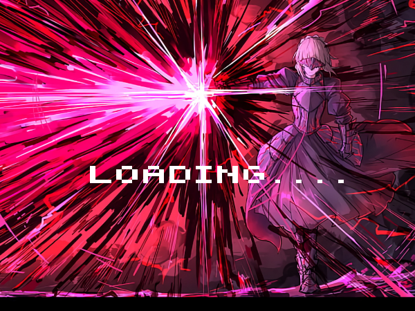

- Khi vào game, người chơi hãy hãy nhấn vào **Start Game** để bắt đầu.

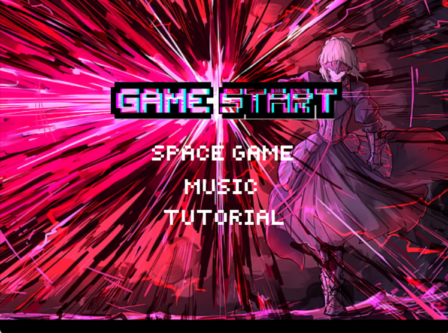

# 2. Chọn level

- có 5 level.  Chỉ cần click chuột để chơi level đó.

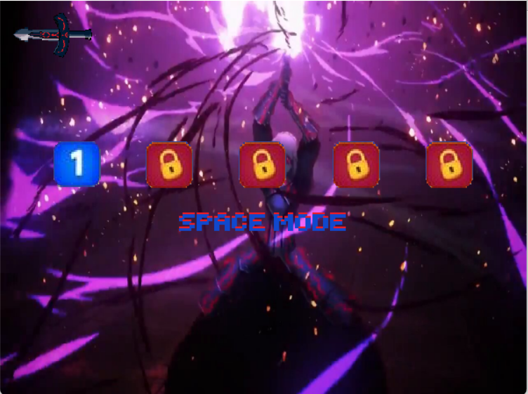

- Tuy nhiên khi mới bắt đầu, bạn chỉ mở được 1 level. Chiến thắng lần lượt từng level để mở khóa và chơi level tiếp theo:

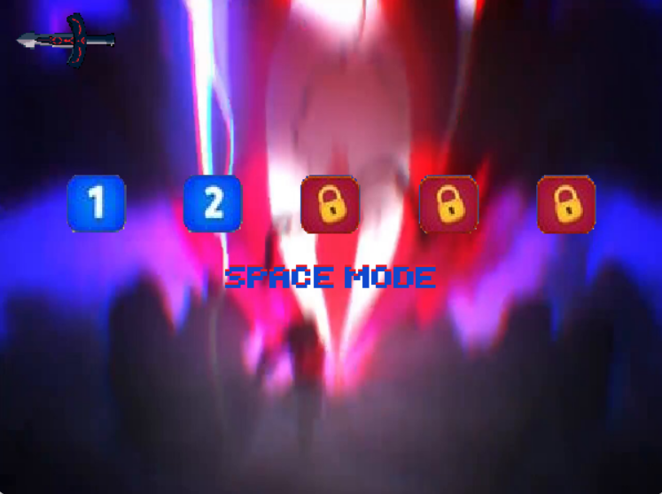

- Ngoài ra còn có 1 nút chức năng khác để người chơi quay lại "GAME START"

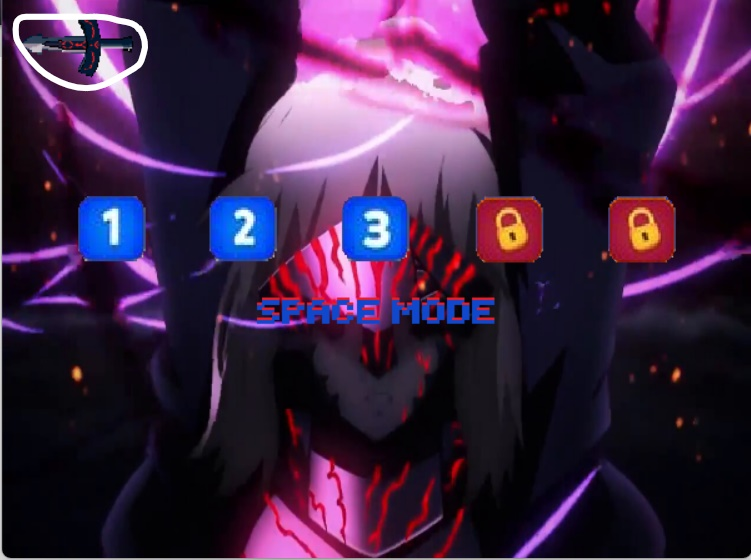

- Khi vào game, sẽ có 1 hoặc 2 con quái sẽ đuổi giết bạn. Nhiệm vụ của bạn là giết nó để qua màn.

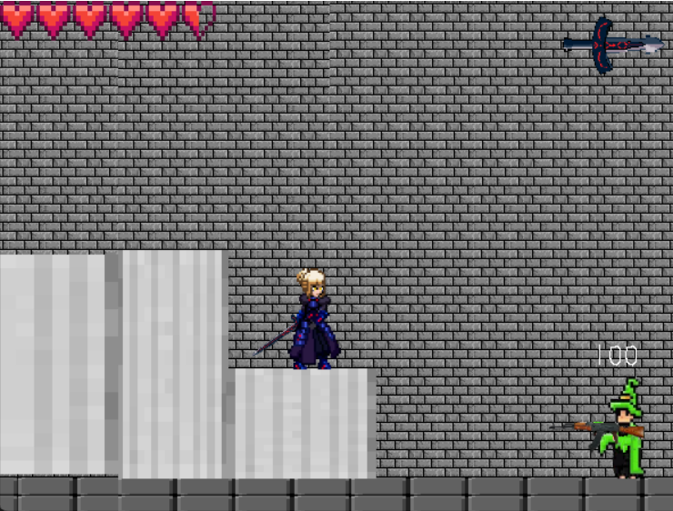

# 3. Chế độ SPACE MOD

- chế độ này là chế độ tự do để thử thách bản thân. Bạn có thể chỉnh mức độ khó, dễ của game trong phần **space game**

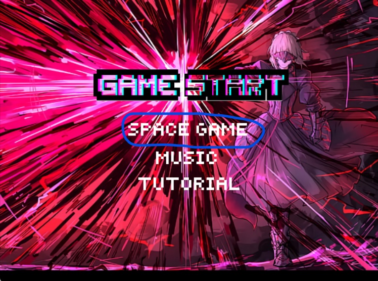

trên màn hình sẽ xuất hiện số quái bạn tiêu diệt

# 4. Các thành phần trong game:

## Trong dao diện **game start**

### Phần **space game** dành cho chế độ **space mode**

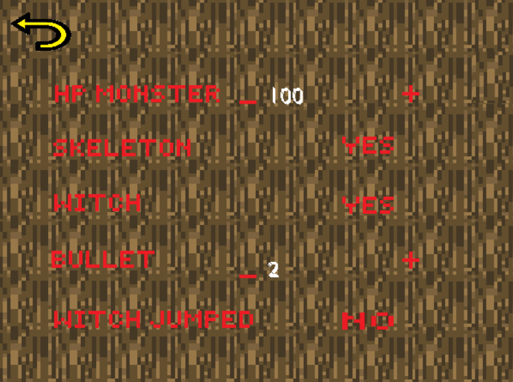

- **HB MONSTER**   : để chỉnh lượng máu của quái
 
- **SKELETON**     : có thể chỉnh cho quái skeleton xuất hiện hoặc không

- **WITCH**        : có thể chỉnh cho quái witch xuất hiện hoặc không

- *lưu ý: không thẻ chỉnh cho cả hai con quái đều không xuất hiện*

- **BULLET**       : có thể tăng hoặc giảm lượng đạn mà quái witch bắn ra

- **WITCH JUMPED** : witch có thể nhảy lên để bắn bạn nếu bạn đứng cao hơn nó

### Phần **muisic**

- **VOLUME**    : chỉnh âm lượng khi bạn tấn công và âm lượng của quái

- **BG VOLUME** : chỉnh âm thanh nền

- **MUISIC**    : thay đổi âm thanh nền

### Phần **tutorial** bao gồm các hướng dẫn cơ bản để chơi

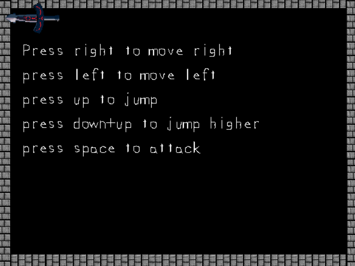

- 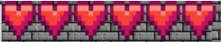 : Tính số là số lượng tim bạn đang có.

- 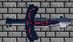 : Tạm dừng game

-  : quay trở lại giao diện **game start**

- Nếu bạn muốn tiếp tục nhấn **continue** 

- Nếu bạn muốn thoát nhấn **exit**

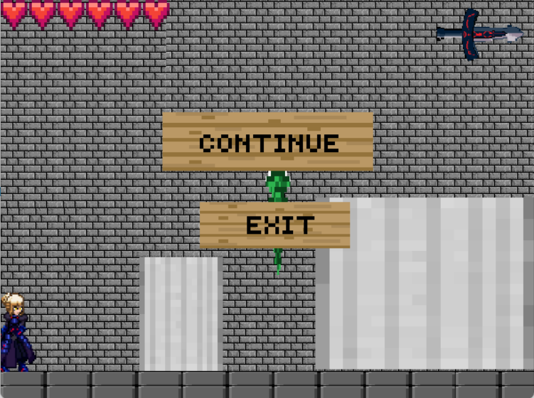

- Giao diện game

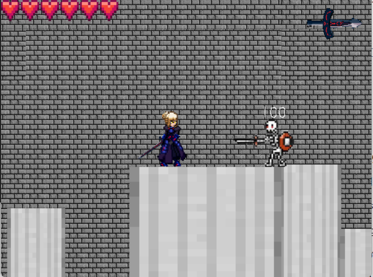

